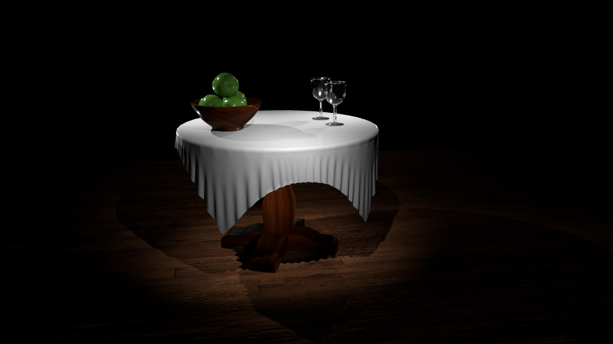
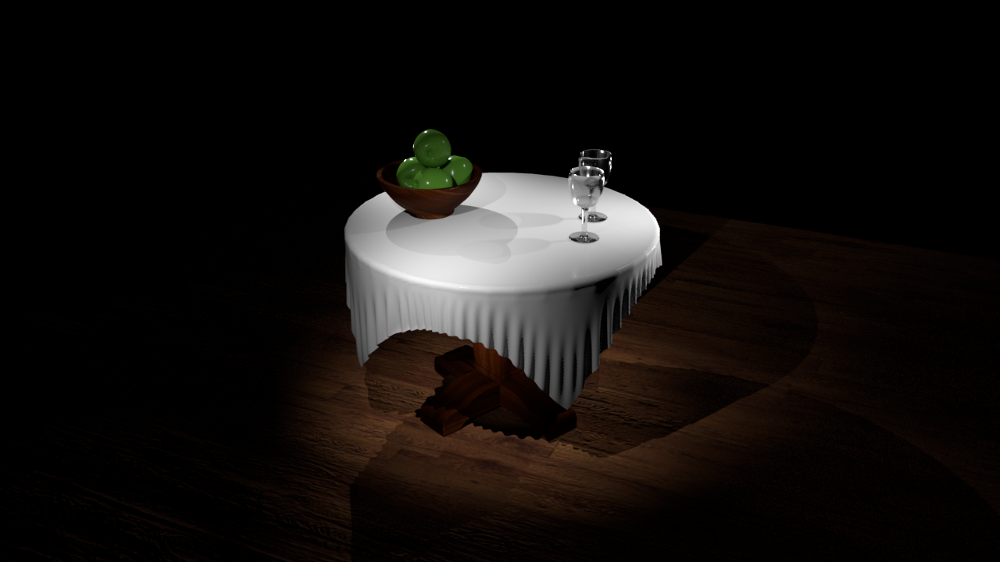
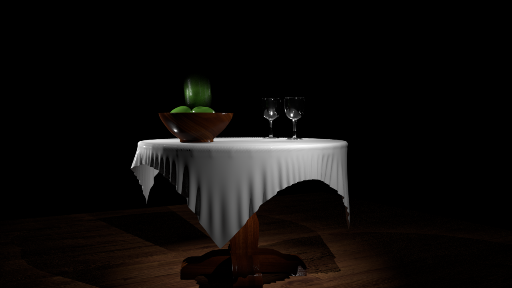
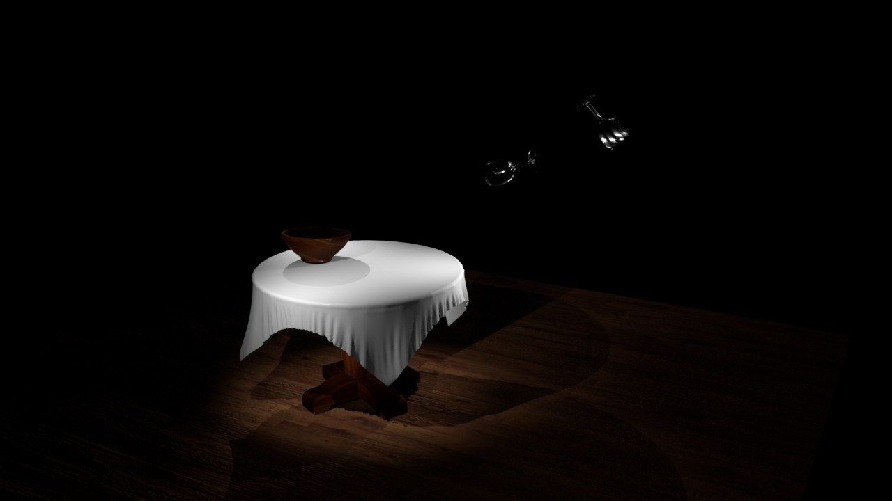
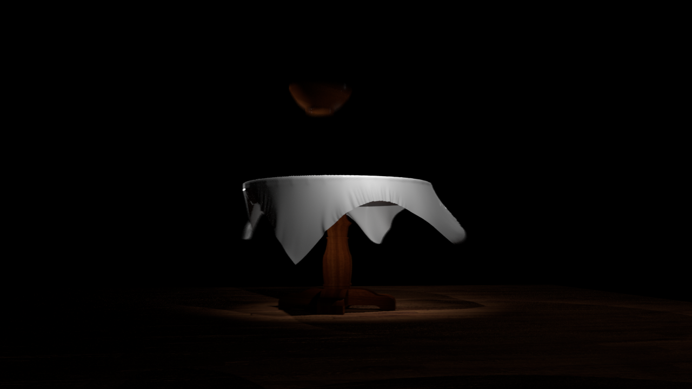

# Still Life Animated
#### May 2020
___

    <video class="figure w-100" autoplay loop muted poster="https://drive.google.com/uc?export=view&id=1gcrj1ZVJ_l0_9n1NxwzGIyOsMJapVUmw">
        <source src="https://drive.google.com/uc?export=view&id=1HxchYWvWEyw8NCSjlCCZdwjZ9552kEUR" type="video/mp4">
    </video>

<!--  -->

 
For the school spring semester of 2020, I took a course titled Intro to 3D Worlds. The class was about developing 3D
models and then bringing them into the real world through the process of milling, laser cutting, and 3D printing.
However, once everyone was locked away in quarantine, the class shifted to entirely creating
3D models, and at the last minute, animating them. Our final assignment for the class was to create a still life in
Maya and animate it in about a week. Already knowing a bit of Maya, I decided to challenge myself and go for something as high quality as I can.
And I'm happy with the results!


https://drive.google.com/uc?export=view&id=11yWXOWpsrXXEYPabt0PNJqOwf2XPDUHU
https://drive.google.com/uc?export=view&id=1jOqbD6tkGwidcNkX5OUSJH8koOi3CMQB
https://drive.google.com/uc?export=view&id=12b9UcPq9olEDeTdN_GV_haQyve_HRWBk
https://drive.google.com/uc?export=view&id=1NE0j-I9HWRbjd5zshTJtG_CXYr82sHZJ
https://drive.google.com/uc?export=view&id=1D3Bvc10F7Vabcw2rNNJ6OLQ5RHuQUBRa



<!-- 

    <video autoplay loop muted poster="../assets/img/work/StillLifeAnimated/StillLifeAnimated.png">
        <source src="../assets/img/work/StillLifeAnimated/StillLifeAnimatedExtended.webm" type="video/webm">
    </video>

    <h4 class="caption">Gif version</h4>
    

    

    

    

    

    

 -->